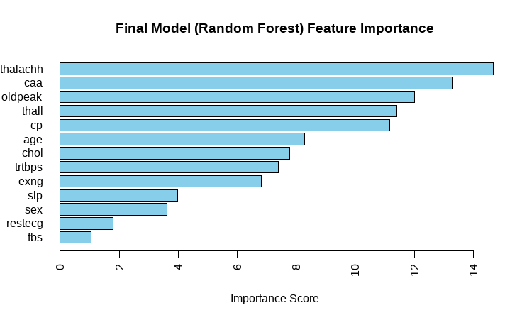

# Heart Attack Risk Prediction

## Problem and Solution

The objective of this project is to develop a predictive model using machine learning algorithms to accurately identify individuals with a higher risk of a heart attack. Additionally, the project aims to determine key contributors to this risk by conducting feature importance analysis, providing insights into preventive measures.

### Solution Overview

- **Identifying High-Risk Individuals**: Employing machine learning algorithms to classify individuals based on their likelihood of experiencing a heart attack.
- **Understanding Key Contributors**: Conducting feature importance analysis to unveil the significant factors influencing heart attack predictions.

## Motivation and Background

Cardiovascular diseases, including heart attacks, account for a substantial number of global deaths. The need for early identification and precise prediction of heart attack risks is critical for implementing timely preventive measures and personalized therapies. This project leverages data science techniques to extract insights from complex datasets, aiding healthcare workers in identifying risk patterns and factors associated with heart attacks.

### Importance of Data Science in Healthcare

- **Enhancing Predictive Models**: Advanced analytics and machine learning algorithms contribute to the creation of reliable risk prediction models.
- **Personalized Treatments**: These models enable proactive and personalized treatments based on an individual's risk profile.
- **Multidisciplinary Data Integration**: Combining varied data sources such as medical records, lifestyle data, and genetic information enhances our understanding of cardiovascular health.

## Dataset

The dataset used for this heart attack analysis and prediction was obtained from [Kaggle](https://www.kaggle.com/datasets/rashikrahmanpritom/heart-attack-analysis-prediction-dataset/data) and contains 303 records with one duplicate entry. Attributes in the dataset include:

- `age`: Age of the patient (in years)
- `sex`: Gender of the patient
- `cp`: Categorized chest pain types (0-3)
- `trtbps`: Resting blood pressure (in mm Hg)
- `chol`: Cholesterol (in mg/dl)
- `fbs`: Fasting blood sugar > 120 mg/dl (1 = true, 0 = false)
- `restecg`: Types of resting electrocardiographic results (0-2)
- `thalachh`: Maximum heart rate achieved
- `exng`: Exercise-induced angina (1 = yes, 0 = no)
- `oldpeak`: ST depression induced by exercise relative to rest
- `slp`: Slope of the peak exercise ST segment (0-2)
- `thall`: Thalassemia rate (0-3)
- `caa`: Number of major vessels (0-3)
- `output (target)`: 0 = less chance of heart attack, 1 = more chance of heart attack

## Algorithms Used

- **[Decision Tree](model/decision_tree.R)**: A Decision Tree algorithm is a predictive model that maps observations about an item to conclusions about its target value.
- **[K-Nearest Neighbors (kNN)](model/kNN.R)**: K-Nearest Neighbors is a non-parametric classification algorithm that categorizes data points based on the majority class of their neighboring instances.
- **[Logistic Regression](model/logistic_reg.R)**: Logistic Regression is a statistical model that analyzes the relationship between a categorical dependent variable and one or more independent variables.
- **[Naïve Bayes](model/naive_bayes.R)**: Naïve Bayes is a probabilistic classifier that applies Bayes' theorem and assumes independence among predictors.
- **[Random Forest](model/random_forest.R)**: Random Forest is an ensemble learning method that constructs multiple decision trees and merges their predictions to improve accuracy and prevent overfitting.
- **[Support Vector Machine (SVM)](model/svm.R)**: Support Vector Machine is a powerful supervised learning algorithm used for classification and regression analysis.
- **[XGBoost](model/xgboost.R)**: XGBoost (Extreme Gradient Boosting) is an optimized gradient boosting algorithm used for classification and regression tasks.
- **[Rule Induction](model/rule_induction.R)**: Rule Induction is a machine learning technique used to generate rules from datasets for classification and prediction.
- **[Neural Net](model/neural_net.R)**: Neural Networks are a class of machine learning algorithms inspired by the structure and functionality of the human brain.

## Results

Here are the evaluation metrics—Accuracy and Recall (Sensitivity)—for various algorithms used in heart attack prediction:

| Algorithm                    | Accuracy | Recall (Sensitivity) |
| ---------------------------- | -------- | -------------------- |
| Decision Tree                | 0.8000   | -                    |
| K-Nearest Neighbors (kNN)    | 0.8333   | -                    |
| Logistic Regression          | 0.8132   | -                    |
| Naïve Bayes                  | 0.8022   | -                    |
| Random Forest                | 0.8667   | 0.9697               |
| Support Vector Machine (SVM) | 0.8667   | 0.9697               |
| XGBoost                      | 0.8667   | 0.9429               |
| Rule Induction               | -        | -                    |
| Neural Net                   | -        | -                    |

Random Forest and SVM showed identical accuracy and recall scores. Due to its simplicity, Random Forest was chosen for heart attack prediction. The feature importance plot below highlights influential predictors:

This visualization identifies key factors affecting heart attack predictions, suggesting potential markers for cardiovascular health or related conditions. Leveraging these insights could improve risk assessment and interventions in heart disease management.
