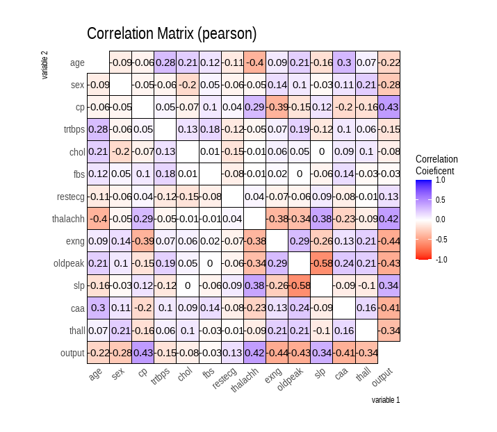

# Heart Disease Dataset Preparation for Modeling

This repository contains code for preparing the `heart.csv` dataset for future modeling and prediction of heart disease. Here's an overview of the steps taken within the code:

## Objective

The primary goal of this code is to perform necessary data processing, exploration, and splitting to create a well-prepared dataset for subsequent modeling tasks aimed at predicting heart disease.

## Overview

The code utilizes various R libraries (`mice`, `dplyr`, `dlookr`, `caret`) for data manipulation, exploration, and modeling to predict heart disease.

## Steps

### 1. Data Loading and Summary

The initial step involves loading the dataset `heart.csv` and examining its structure using `summary()` and `sapply()` to understand the variables' summary statistics and classes.

### 2. Data Cleaning

- `unique()`: Removes duplicate entries in the dataset.
- `md.pattern()`: Checks for missing values in the dataset.

### 3. Data Exploration

#### Univariate Analysis

- `describe()`: Generates descriptive statistics of the dataset.
- `normality()`: Tests for normality in the variables.
- `plot_normality()`: Visualizes the normality of variables.

#### Bivariate/Multivariate Analysis

- `correlate()`: Calculates the correlation coefficient among variables.
- Visualization: Generates a correlation matrix plot using `correlate()` and `plot()`.

### 4. Train/Test Split

- `createDataPartition()`: Splits the dataset into training and testing sets with a 70/30 ratio.
- Two resulting datasets:
  - `train_df`: Contains 70% of the data for training the model.
  - `test_df`: Holds the remaining 30% for model evaluation.

### 5. Saving Data

The final step saves relevant data (`df`, `seed`, `r_train`, `train_df`, `test_df`) into `dataset.RData` for future use.

## Correlation Plot

The correlation plot showcasing the relationships between variables is generated by the code and saved as `correlation_matrix.png`.

